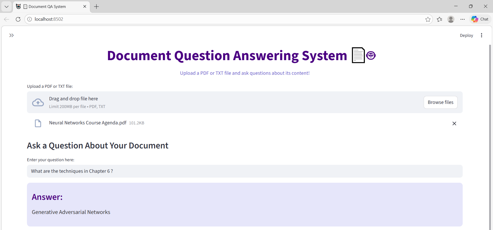

# Document QA System
A Document Question Answering System built with Transformers and Streamlit, allowing users to upload PDF or TXT files and ask questions about their content. The system can detect chapters and answer questions based on specific sections for more accurate results.

## Features
- Upload PDF or TXT documents.
- Automatically splits text into chapters for better QA accuracy.
- Ask any question and get relevant answers using a pretrained Transformers QA model (distilbert-base-cased-distilled-squad).
- Beautiful and interactive Streamlit UI with styled answers and chapter sidebar.
- Works with both short and long documents.
- Easy to extend with RAG/FAISS for larger datasets in the future.

## streamlit run app.py
1. Upload a PDF or TXT file.
2. Enter your question in the input box.
3. Get the answer displayed in a styled box.
4. Optional: check the sidebar to see chapters in the document.

## Project Structure
- Document_QA_System/
  - app.py
  - README.md
  - example.pdf

## Technologies Used
- Python 3.10+
- Transformers (Hugging Face)
- PyTorch
- Streamlit
- PyPDF2 (PDF reading)

## Future Improvements
- Integrate RAG + FAISS for large document QA.
- Highlight answers directly in the PDF text.
- Add multi-language support.
- Improve UI with interactive elements for selecting chapters/questions.

## Screenshot

